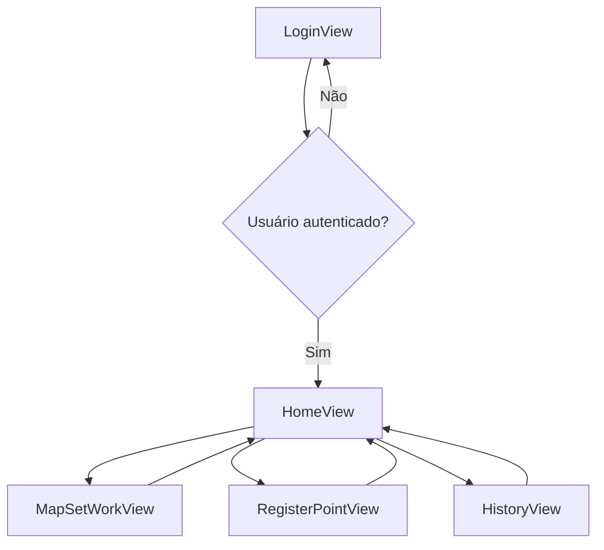
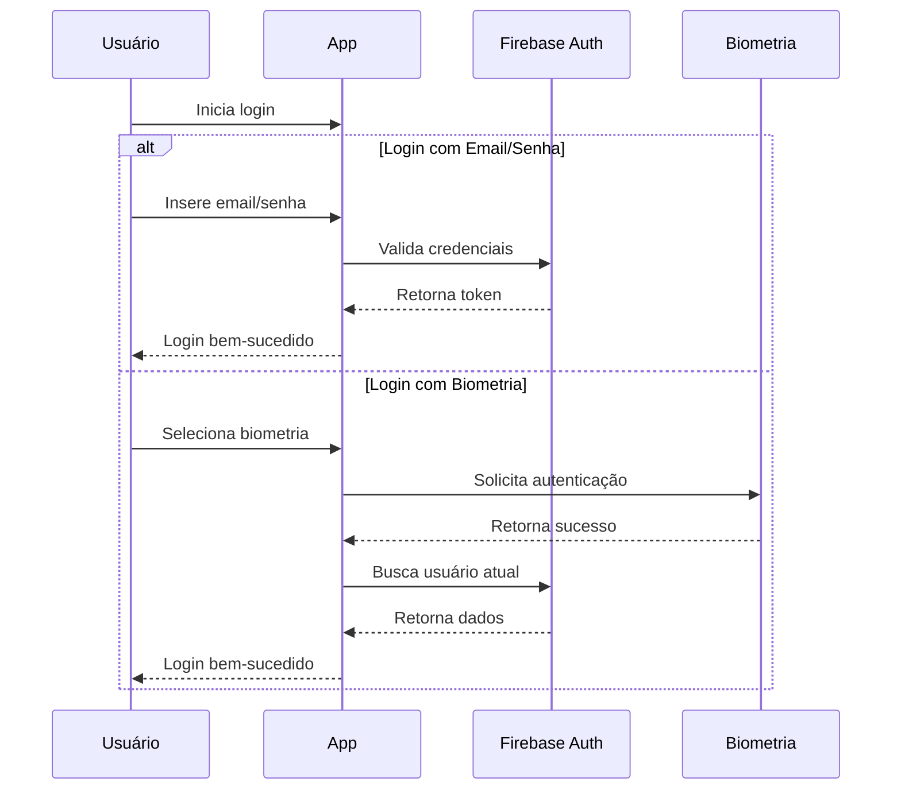
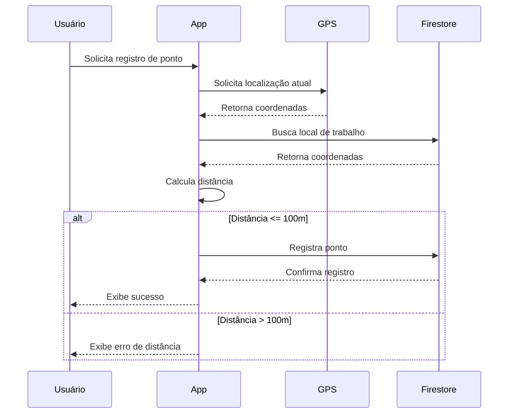

# 📱 Sistema de Registro de Ponto com Geolocalização e Biometria

## 📋 Descrição do Projeto

Sistema mobile desenvolvido em Flutter para registro de ponto de trabalho com validação de localização e autenticação biométrica. O aplicativo permite que funcionários registrem seu ponto apenas quando estiverem a até 100 metros do local de trabalho definido.

---

## 🎯 Objetivos

- Implementar sistema de autenticação seguro com email/senha e biometria
- Desenvolver funcionalidade de geolocalização para validação de proximidade
- Criar interface intuitiva para registro e consulta de pontos
- Integrar com Firebase para armazenamento em tempo real
- Garantir experiência de usuário fluida e responsiva

---

## ⚙️ Funcionalidades Principais

### 🔐 Autenticação
- Login com email e senha
- Autenticação biométrica (Face ID, Touch ID, Digital)
- Registro de novos usuários
- Logout seguro

### 🗺️ Gestão de Localização
- Definição do local de trabalho via mapa interativo
- Validação em tempo real da distância (até 100m)
- Visualização de localização atual e local de trabalho

### ⏰ Registro de Ponto
- Registro de ponto com data/hora automática
- Validação automática de proximidade
- Histórico completo de registros
- Interface de registro com múltiplas opções de autenticação

---

## 📱 Diagrama de Navegação



---

## 🗃️ Modelos de Dados

### LocationPoint
```dart
{
  "latitude": double,
  "longitude": double
}
```

### WorkPoint
```dart
{
  "userId": string,
  "timestamp": DateTime,
  "latitude": double,
  "longitude": double,
  "isWorking": boolean
}
```

### User
```dart
{
  "uid": string,
  "email": string,
  "createdAt": DateTime
}
```

---

## 🔧 Tecnologias e Bibliotecas

### Core Framework
- **Flutter 3.x** - Framework principal
- **Dart 3.x** - Linguagem de programação

### Backend & Database
- **Firebase Authentication** - Autenticação de usuários
- **Cloud Firestore** - Banco de dados NoSQL em tempo real
- **Firebase Core** - Configuração base do Firebase

### Geolocalização e Mapas
- **Geolocator 11.0** - Obtenção de localização do dispositivo
- **Flutter Map 6.1** - Renderização de mapas OpenStreetMap
- **LatLong2 0.9** - Manipulação de coordenadas geográficas

### Segurança e Biometria
- **Local Auth 2.1** - Autenticação biométrica nativa
- **Permission Handler** - Gerenciamento de permissões

### UI/UX
- **Material Design 3** - Design system
- **Google Fonts** - Tipografia
- **Flutter Launcher Icons** - Ícones do aplicativo

---

## 📊 Estrutura do Projeto

```
lib/
├── main.dart
├── firebase_options.dart
├── controllers/
│   ├── firebase_controller.dart
│   └── point_controller.dart
├── models/
│   ├── location_point.dart
│   └── work_point.dart
├── views/
│   ├── login_view.dart
│   ├── registro_view.dart
├   ├── map_points_view.dart
│   ├── home_view.dart
│   ├── map_set_work_view.dart
│   ├── registro_ponto_view.dart
│   └── historico_view.dart
└── controllers/
    ├── firebase_controller.dart
    └── point_controller.dart
```

---

## ⚙️ Requisitos Funcionais

### RF01 - Autenticação de Usuários
- **RF01.1**: Sistema deve permitir registro com email e senha
- **RF01.2**: Sistema deve permitir login com email e senha
- **RF01.3**: Sistema deve permitir autenticação biométrica
- **RF01.4**: Sistema deve validar credenciais no Firebase Auth

### RF02 - Gestão de Localização
- **RF02.1**: Sistema deve permitir definição do local de trabalho
- **RF02.2**: Sistema deve obter localização atual do dispositivo
- **RF02.3**: Sistema deve calcular distância entre localizações
- **RF02.4**: Sistema deve validar se usuário está dentro do raio de 100m

### RF03 - Registro de Ponto
- **RF03.1**: Sistema deve registrar ponto com timestamp
- **RF03.2**: Sistema deve armazenar localização do registro
- **RF03.3**: Sistema deve validar autenticação antes do registro
- **RF03.4**: Sistema deve impedir registro fora do raio permitido

### RF04 - Consulta de Histórico
- **RF04.1**: Sistema deve exibir histórico de pontos do usuário
- **RF04.2**: Sistema deve ordenar registros por data decrescente
- **RF04.3**: Sistema deve atualizar lista em tempo real

---

## 🛡️ Requisitos Não Funcionais

### RNF01 - Desempenho
- **RNF01.1**: Tempo de resposta inferior a 2 segundos para operações críticas
- **RNF01.2**: Interface deve manter 60fps durante navegação
- **RNF01.3**: Aplicativo deve consumir menos de 50MB de RAM

### RNF02 - Segurança
- **RNF02.1**: Dados sensíveis devem ser armazenados de forma segura
- **RNF02.2**: Comunicação com Firebase deve usar HTTPS
- **RNF02.3**: Permissões de localização devem ser solicitadas adequadamente

### RNF03 - Usabilidade
- **RNF03.1**: Interface deve seguir guidelines do Material Design 3
- **RNF03.2**: Aplicativo deve ser intuitivo para usuários leigos
- **RNF03.3**: Feedback visual deve ser fornecido para todas as ações

### RNF04 - Compatibilidade
- **RNF04.1**: Suporte a Android API 21+ (Android 5.0+)
- **RNF04.2**: Suporte a iOS 13+
- **RNF04.3**: Interface responsiva para diferentes tamanhos de tela

---

## 🚀 Configuração do Ambiente

### Pré-requisitos
- Flutter SDK 3.0+
- Dart SDK 3.0+
- Android Studio ou VS Code
- Dispositivo Android/iOS ou emulador

### Configuração do Firebase

1. **Criar Projeto no Firebase Console**
   ```bash
   - Acesse https://console.firebase.google.com
   - Clique em "Adicionar projeto"
   - Siga o assistente de configuração
   ```

2. **Configurar Authentication**
   ```bash
   - No console Firebase, vá em "Authentication"
   - Clique em "Começar"
   - Ative "Email/senha" como provedor
   ```

3. **Configurar Firestore**
   ```bash
   - Vá em "Firestore Database"
   - Clique em "Criar banco de dados"
   - Escolha modo de teste
   - Defina localização do servidor
   ```

4. **Configurar Aplicativo Android**
   ```bash
   - No projeto Firebase, clique em "Android"
   - Insira o package name: com.example.form_mobile_avaliativa
   - Baixe google-services.json
   - Coloque em android/app/google-services.json
   ```

### Instalação e Execução

1. **Clone e Instale Dependências**
   ```bash
   git clone [url-do-repositorio]
   cd form_mobile_avaliativa
   flutter pub get
   ```

2. **Configure Permissões (Android)**
   Edite `android/app/src/main/AndroidManifest.xml`:
   ```xml
   <uses-permission android:name="android.permission.ACCESS_FINE_LOCATION" />
   <uses-permission android:name="android.permission.ACCESS_COARSE_LOCATION" />
   <uses-permission android:name="android.permission.ACCESS_BACKGROUND_LOCATION" />
   <uses-permission android:name="android.permission.INTERNET" />
   ```

3. **Execute o Aplicativo**
   ```bash
   flutter clean
   flutter pub get
   flutter run
   ```

---

## 📖 Manual do Usuário

### Primeiro Acesso
1. **Registro**: Toque em "Ainda não tem conta? Registre-se!!!"
2. **Informe email e senha** nos campos correspondentes
3. **Confirme a senha** e toque em "Registrar"

### Definindo Local de Trabalho
1. **Faça login** com suas credenciais
2. **Toque em "Definir Local de Trabalho"**
3. **No mapa**, toque no local desejado
4. **Toque em "Salvar Local de Trabalho"**

### Registrando Ponto
1. **Na tela inicial**, toque em "Bater Ponto"
2. **Verifique** se está dentro do raio de 100m
3. **Escolha** entre "Registrar com Senha" ou "Registrar com Biometria"
4. **Confirme** a autenticação quando solicitado

### Consultando Histórico
1. **Na tela inicial**, toque em "Histórico de Pontos"
2. **Visualize** todos os registros em ordem decrescente
3. **Cada registro** mostra data, hora e localização

---

## 🔒 Fluxo de Autenticação



---

## 🗺️ Fluxo de Geolocalização



---

## 🐛 Solução de Problemas Comuns

### Mapa Não Carrega
- Verifique conexão com internet
- Confirme permissões de localização
- Reinicie o aplicativo

### Erro de Autenticação
- Verifique email e senha
- Confirme se o usuário está registrado
- Tente usar biometria como alternativa

### Localização Não Precisa
- Ative GPS de alta precisão
- Aguarde alguns segundos para melhor precisão
- Verifique se há obstáculos bloqueando sinal

### Firebase Errors
- Verifique conexão com internet
- Confirme configuração do Firebase
- Verifique regras de segurança do Firestore

---

## 👥 Contribuição

1. Fork o projeto
2. Crie uma branch para sua feature (`git checkout -b feature/AmazingFeature`)
3. Commit suas mudanças (`git commit -m 'Add some AmazingFeature'`)
4. Push para a branch (`git push origin feature/AmazingFeature`)
5. Abra um Pull Request

