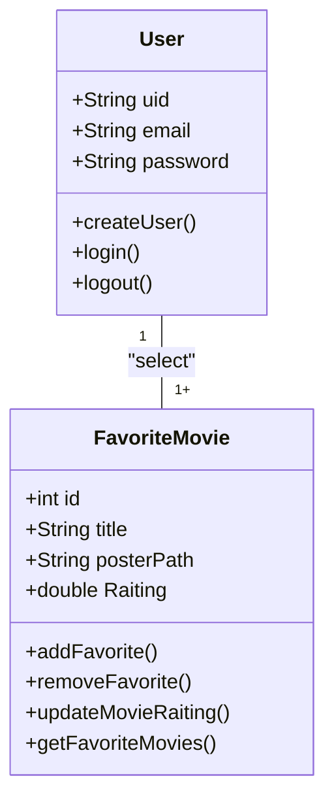
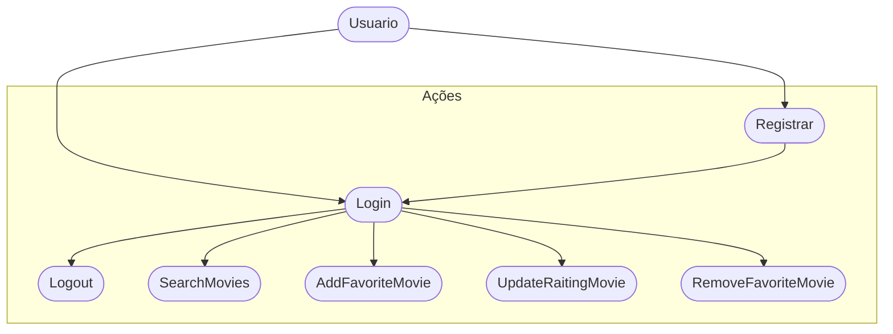
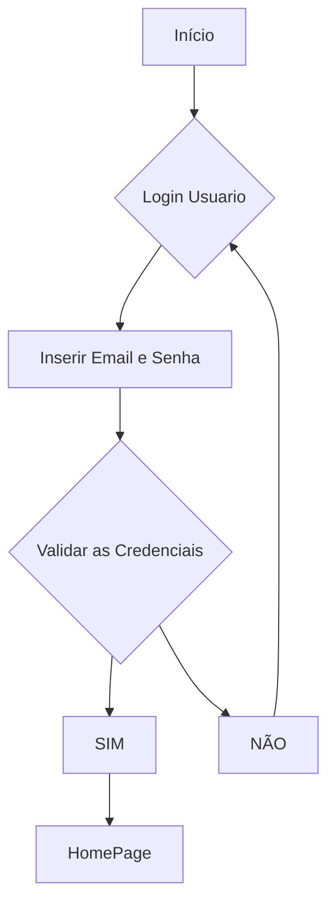

# Cine Favorite (Formativa)
Construir um Aplicativo do zero - O CineFavorite que permitira criar uma conta e buscar filmes em uma API e montar uma galeria pessoal de filmes favoritos, com posters e notas avaliativas do usuario para o filme.

## Objetivos
- Criar uma Galeria personalizada por usuario de filmes favoritos
- Conectar o App com uma API(base de dados) de Filmes (TMDB)
- Permitir a Criação de Contas para Cada Usuário
- Listar filmes por uma Palavra-Chave

## Levantamento de Requisitos do Projeto
- ### Funcionais

- ## Não Funcionais

## Recursos do Projeto
- Linguagem de Programação : Flutter/Dart
- API TMDB : Base de dados para filmes
- Firebase: Authentication / FireStore
- Figma : Prototipagem
- VSCode : Desenvolvimento
- GitHub : Controle de Versionamento

## Diagramas
1. ### Diagrama de Classes
Demonstrar o Funcionamento das Entidades do Sistema

- Usuário (User): Classe já modelada pelo FirebaseAuth
    - Atributos: email, senha, uid
    - Métodos: Login(), Registrar(), Logout()

- Filmes Favoritos (FavoriteMovie): Classe modelada pelo DEV
    - Atributos: id, título, PosterPath, Nota
    - Métodos: AdicionarFilme(), RemoverFilme(), ListarFilme(), AtualizarNota() (CRUD)

2. ### Diagrama de Casos de Uso
Ação que os Atores podem Fazer
- Usuário (User):
    - Registrar
    - Login
    - Logout
    - Procurar Filmes na API
    - Salvar filmes aos Favoritos
    - Dar nota aos Filmes Favoritos
    - Remover Filme dos Favoritos

3. ### Fluxo
Determina o caminho percorrido pelo autor para Executar uma Ação

- Fluxo da Ação de Login

## Prototipagem
Link dos Protótipos: https://www.figma.com/design/EnNIV0slYk2gsNFZqr25HA/Untitled?t=6pulWhQp9jmE8WXo-1

## Codificação

- Service --> Conectar com a API
- Model --> Favorite Movie
- Controller -> FireStore DataBase - Incompleto
- View -> Registro, Login, FavoriteView, SearchView
