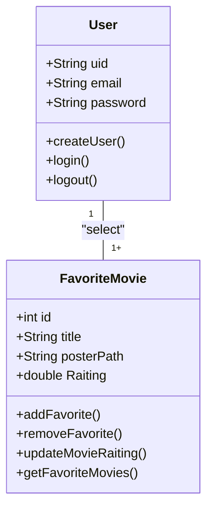

# Cine Favorite (Formativa)
Construir um Aplicativo do zero - O CineFavorite que permitira criar uma conta e buscar filmes em uma API e montar uma galeria pessoal de filmes favoritos, com posters e notas avaliativas do usuario para o filme.

## Objetivos
- Criar uma Galeria personalizada por usuario de filmes favoritos
- Conectar o App com uma API(base de dados) de Filmes (TMDB)
- Permitir a Criação de Contas para Cada Usuário
- Listar filmes por uma Palavra-Chave

## Levantamento de Requisitos do Projeto
- ### Funcionais

- ## Não Funcionais

## Recursos do Projeto
- Linguagem de Programação : Flutter/Dart
- API TMDB : Base de dados para filmes
- Firebase: Authentication / FireStore
- Figma : Prototipagem
- VSCode : Desenvolvimento
- GitHub : Controle de Versionamento

## Diagramas
1. Diagrama de Classes
Demonstrar o Funcionamento das Entidades do Sistema

- Usuário (User): Classe já modelada pelo FirebaseAuth
    - Atributos: email, senha, uid
    - Métodos: Login(), Registrar(), Logout()

- Filmes Favoritos (FavoriteMovie): Classe modelada pelo DEV
    - Atributos: id, título, PosterPath, Nota
    - Métodos: AdicionarFilme(), RemoverFilme(), ListarFilme(), AtualizarNota() (CRUD)

2. Diagrama de Fluxo de Dados